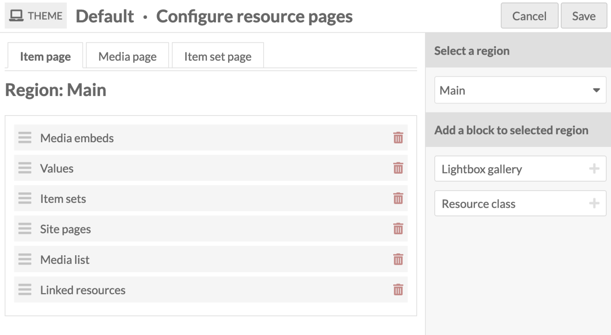
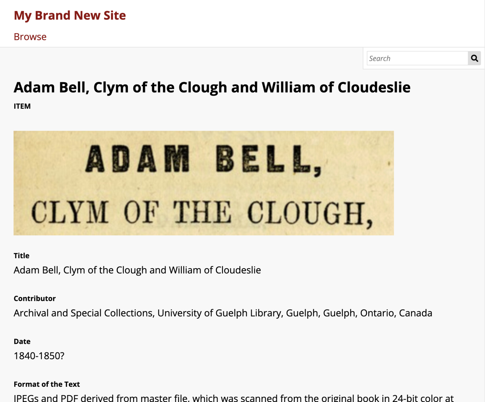

# アイテム

アイテムはOmekaシステムの構成要素です。

アイテムは物理的なオブジェクト（写真、地図、書籍）を表す必要はなく、[添付メディア](media.md)を持っている必要もありません（写真のスキャンや複数ページの画像、PDFなど）。アイテムはノードとして使用できるものであり、人物、場所、事物を表す方法です。アイテムとそのクラスを使用して、サイトの目的に応じた異なるタイプのノードを作成できます。

アイテムは、複雑な関係を表すために他のアイテムにリンクされたり、アイテムセットに含まれたりすることができます。例えば、場所として使われるアイテムは、その場所で起こったイベントを表すアイテムにリンクされ、イベントアイテムはイベントに参加していた人物アイテムにリンクされ、それ自体が作成されたテキストアイテムや写真アイテムにリンクされていることがあります。これらのアイテムは、ある特定の時間に場所、イベント、人物を含む管轄区域を表す重複するアイテムセットでグループ化されることがあります。または、人物を表すアイテムセットを使用し、その中に作成された作品をアイテムとして含め、これらの人物アイテムセットをイベントや写真とリンクすることもできます。

これらのクラスや多くのリソーステンプレートのうち多くは、Omeka Sの基本インストールで既に存在しますが、必要に応じてそれらを変更したり追加したりすることができます。

## アイテムの権限

ユーザーがアイテムを作成すると、「所有者」となります。ほとんどのユーザーレベルはアイテムを作成する権限を持ち、自分のアイテムは常に削除できます。他者の所有するアイテムを削除できるのは上級レベルのユーザーだけです。

| カテゴリ | 権限 | グローバル管理者 | スーパーバイザー | エディター | レビュアー | 著者 | 研究者 |
|----|----|---|---|---|---|---|---|
| アイテム & メディア | 追加 | はい | はい | はい | はい | はい | いいえ |
| | 編集 | すべて | すべて | すべて | すべて | 自分のもの | いいえ |
| | 削除 | すべて | すべて | すべて | 自分のもの | 自分のもの | いいえ |
| 値の注釈 | 追加/編集 | はい | はい | はい | はい | はい | いいえ |
| 非公開のオブジェクト | 閲覧 | はい | はい | はい | はい | いいえ | いいえ |

ユーザーの役割を変更する際、例えば著者から研究者に変更した場合でも、以前に作成したアイテムの所有権は変わりません。アイテムは移転されません。ユーザーを削除すると、アイテムが所有者なしとなります。現在のところ、所有者なしのアイテムを検索して一括編集することはできませんが、現状のベストプラクティスは、ユーザーアカウントを削除する前にこれらのアイテムを再割り当てすることです。

### サイトのアイテム権限

Omeka Sインストール内のすべてのアイテムは全てのサイトに追加が可能ですが、手動またはユーザー固有の設定またはサイト固有の設定を通じてサイトに追加する必要があります。

各サイトは、新しいアイテムが自動的に追加されるように設定できます。

各ユーザーは、[デフォルトで新しいアイテムを追加するサイトを1つまたは複数設定](../admin/users.md#user-settings)することができます。ユーザーが自分の「デフォルトのアイテム用サイト」としてサイトを設定している場合は、「その設定が機能するために」サイトにクリエイターまたはマネージャーとして追加する必要があります。

| カテゴリ | 権限 | サイトマネージャー | サイトクリエイター | サイト閲覧者 | グローバル管理者 | スーパーバイザー |
|----|----|---|---|---|---|---|
| アイテム | サイトへの追加 | はい | はい (デフォルトでは可)、手動では不可 | いいえ | はい | はい |
| | サイトからの削除 | はい | いいえ | いいえ | はい | はい |

### アイテムの公開ビュー

Omekaサイト内のアイテムは、サイト作成時に自動的にナビゲーションに追加される「アイテム一覧」ページから閲覧できます。個々のアイテムは、サイトのリソースプールに追加されると、個別のアイテム表示ページを表示します。このページのレイアウトは、「テーマ」タブで「リソースページの設定」ボタンを使用して設定できます。

デフォルトでは、アイテム表示ページは上部にアイテムのタイトル、次にアイテムに添付されたメディアのレンダリング、そしてプロパティ値をテキストとして表示します。

テーマで利用可能な領域のいずれかに追加されたページブロックは、コンテンツがある場合にのみ個別のアイテム表示ページに表示され、そうでなければ非表示になります。

## アイテムタブ

アイテムは、管理ダッシュボードの左側のナビゲーションにある**アイテム**タブ（箱のアイコン）にリストされています。

各アイテムが1行で表示され、以下の列があります：

- **タイトル**
- **編集**（鉛筆）、**削除**（ごみ箱）、**詳細**（省略記号）のアイコン
- **クラス**
- アイテムの**所有者**
- アイテムが**作成された**日付。

アイテム画面の右上隅には、「新しいアイテムを追加」ボタンがあります。

アイテムのナビゲーションと作成に関するオプションは、アイテムテーブルのヘッダーにあります。

- 左側にはアイテムのページをコントロールするボタンがあり、進むと戻る矢印、現在のページ番号を入力する編集可能なボックスがあります。有効なページ番号を入力してEnterキーを押せば、そのページに移動します。

- 中央には[詳細検索](../search.md#item-advanced-search)のリンクがあります。

- 右側には、アイテムテーブルの並べ替えオプションがあります。2つのドロップダウンメニューがあります。デフォルトでは、テーブルのアイテムは、最も最近追加されたアイテムが上に来るように並んでいます（作成日時 & 降順）。最初のドロップダウンでは、**タイトル**、**識別子**、**クラス**、**所有者**、および**作成日時**の間で選択できます。2番目のドロップダウンでは、昇順（A-Zまたは最も古いものから最も新しいもの）または降順（Z-Aまたは最新のものから最も古いもの）で並べ替えることができます。適用するには、「並べ替え」ボタンをクリックします。

これらとテーブルの間には、左側に選択したアイテムを一括で編集、一括編集、選択したアイテムを削除、すべてのアイテムを削除するオプションを含むドロップダウンがあります。

## アイテムの表示

アイテムについての基本情報を素早く表示するには、行内の**詳細**（省略記号）ボタンをクリックします。編集ボタンと削除ボタンの隣にあります。これにより、リストの右側にドローが開き、アイテムのタイトル、説明、表示状態、アイテムが使用されているサイト、関連メディアが表示されます。

アイテムの詳細についてより詳しく見るには、アイテム一覧のテーブルでのアイテムのタイトルをクリックするか、その詳細を表示しているときにクリックします。

青い四角は、詳細なアイテムビューを開くクリック箇所を示しています。

個々のアイテムを表示すると、アイテムの**メタデータ**と**リンクされたリソース**についてのタブがあります。このページの右側には、アイテムのメディア、属する**アイテムセット**、作成日、所有者、表示状態が表示されます。

### リンクリソース

アイテムの**リンクリソース**は、プロパティを介してこのアイテムにリンクされている他のOmekaリソース（アイテム、アイテムセット、メディア）です。このセクションは、プロパティにそのアイテムを持つリソース（*リンクされている* リソース）を表示することに注意してください。*から* リンクされるリソースは、それらが満たすプロパティに表示されます。

リンクリソースは、現在のアイテムを使用するプロパティごとにグループ化されます。以下の例では、現在のアイテム「ウィリアム・シェイクスピア」がリンクされているリソースのプロパティ「クリエイター」「参照」「著者リスト」に使用されています。

「プロパティによるフィルタ」のドロップダウンを使用して、特定のプロパティを参照するリンクリソースのみを表示できます。これは実際に使用されているプロパティのみを表示します。

公開サイトでリソースが表示される場合、リンクリソースは使用されているメタデータプロパティに基づいた一連のテーブルで表示されます。リソースはリソースタイプ（アイテム、アイテムセット、またはメディア）によってソートされ、一度に1つのタイプのみが表示されます。リンクリソースがないリソースはこれらのテーブルを表示しません。テーブルは[サイトテーマ設定の「リソースページの設定」](../sites/site_theme.md#configure-resource-pages)を使用して含める、除外する、または再配置することができます。

指定された公開サイトに含まれていない他のリソースへのリンクがあるリソースは、含まれていないリソースも表示します。これらのリンクリソースはサイトの一部であるかのように表示されます（つまり、それらをクリックしてアイテムやアイテムセットのページを表示できます）。[この設定は各サイトで無効にできます](../sites/site_settings.md#show)。非サイトリソースが除外されている場合、アイテムのメタデータ値とリンクリソーステーブルは除外されたOmekaリソースを表示しません。

メディアページは、アイテムがそれらにリンクしているかどうかに関係なく、リンクリソーステーブルを表示しないことに注意してください。

次のアイテムは、「貢献者」プロパティに多数のOmekaリソースが含まれており、メタデータの一部として表示されています。また、それらの同じアイテムがそれにリンクし返しており、リンクリソーステーブルに表示されています。

リソースページでのリンクリソースの表示は各サイトで設定できます。「テーマ」をクリックし、「[リソースページの設定](../sites/site_theme.md#configure-resource-pages)」ボタンをクリックして、各リソースの「リンクリソース」テーブルを表示するかどうかと場所を決定します。

また、リンクされるリソースが[指定されたサイトに含まれていないリソース](../sites/site_resources.md)である場合でも、それらのリンクを表示するかどうかを制御することもできます。[サイト設定の「表示」セクション](../sites/site_settings.md#show)で、「サイトに含まれていないリソースを除外する」のチェックボックスがあります。

## アイテムの追加

新しいアイテムを追加するには、まず「新しいアイテムを追加」ボタンを選択します。

アイテムを作成する前に、スーパーバイザーは様々なアイテムタイプの特定のフィールドを読み込む[リソーステンプレート](resource-template.md)を作成することをお勧めします。

### 値

値タブは、タイトル、説明などのメタデータを入力する場所です。

ドロップダウンメニューからリソーステンプレートを選択できます。リソーステンプレートはスーパーバイザーとエディターによって定義されます。

- リソーステンプレートを使用する場合、アイテムクラスは自動的に読み込まれるはずです。
- リソーステンプレートを使用しない場合、ドロップダウンメニューからクラスを選択できます（これらはインストールの[語彙](vocabularies.md)から取得されます）。

読み込まれたプロパティに情報を追加します。リソーステンプレートやクラスを選択しない場合、Dublin Coreプロパティのタイトルと説明が自動的に読み込まれます。

リソーステンプレートを使用するかどうかに関係なく、画面の右側にあるドロワーを使用してアイテムにより多くのプロパティを追加できます。語彙の1つ（Dublin Core、書誌オントロジーなど）を開いて追加したいプロパティをクリックするか、「プロパティのフィルタ」ボックスを使用して特定のプロパティを検索できます（複数の大きな語彙がある場合に役立ちます）。

ドロワー内のプロパティラベルをクリックすると、自動的にアイテムに追加されます。誤ってプロパティを追加した場合は、空白のままにしておけば、変更を保存するときにアイテムから削除されます。

各フィールドには、テキスト、インストールからのリソース、または外部リンクを追加できます。

各プロパティの目のアイコンを使用して、個々のプロパティを**プライベートまたはパブリック**に設定できます。プライベートに設定されたプロパティも、グローバル管理者、スーパーバイザー、エディターからは見えることに注意してください。著者は所有するアイテムのすべてのプロパティを見ることができますが、他のユーザーが作成したプライベートプロパティは見ることができません。

下の画像では、最初のプロパティ（タイトル）は開いた目のアイコンで示されるようにパブリックです。2番目のプロパティ（説明）は斜線が入った目のアイコンで示されるようにプライベートです。目のアイコンをクリックするかエンターキーを押すと、パブリックとプライベートが切り替わります。

プロパティに複数の値がある場合、ドラッグアンドドロップで**並べ替え**ることができます。値の左側のバーをクリックしてその値を掴み、希望の順序にドラッグします。

#### テキスト

テキストフィールドは書式なしテキストの入力を可能にします。これらのフィールドではマークアップは許可されていません（例：Markdown、HTML）。

入力の上にある地球儀シンボルを使用して、テキスト入力の内容の言語を示すことができます（下の画像の赤い矢印を参照）。地球儀をクリックしてテキストフィールドを有効にし、テキストが書かれている言語の[IETF 2文字言語タグ](https://en.wikipedia.org/wiki/IETF_language_tag){target=_blank}コードを入力します。

#### Omekaリソース

Omekaリソースをメタデータ値として選択すると、作成しているリソースとそのフィールドを満たすリソースとの間に[内部リンクが作成されます](#linked-resources)。

アイテムを作成する際、別のアイテムまたはアイテムセットを使用するオプションがあります。アイテムにメディアが添付されている場合、そのメディア内からも選択できます - インストール内の他のメディアからは選択できません。

リソースタイプを選択すると、インストール内のそれらのリソースをすべて閲覧できるサイドドロワーが開きます。ドロワーの上部にある検索機能を使用してリストを絞り込んだり、特定のリソースをすばやく見つけたりできます。

リソースを選択すると、詳細情報が読み込まれ、リソースをリンクするには「リソースを選択」をクリックする必要があります。右上角の「X」ボタンをクリックしてリソースのリストに戻ることもできます。

プロパティに**アイテム**リソースを使用している場合、ドロワーで必要なアイテムを見つけるための3つの追加オプションがあります。「検索をフィルタ」という文句の隣にある三角ボタンをクリックしてこれらのオプションを開きます。これにより、ドロワー内のアイテムをフィルタするための以下のオプションを含むメニューが開きます：

- クラスによるフィルタ：インストールの語彙によって提供される任意のクラスを選択できるドロップダウン。
- アイテムセットによるフィルタ：ドロワーに表示されるアイテムを特定のアイテムセットに関連付けられたもののみに制限できるドロップダウン。
- アイテムIDによるフィルタ：使用したいアイテムのIDを入力できるテキストフィールド。アイテムのIDは編集ページのURLで見つけることができます；アイテムを編集していてURLが`admin/item/11547/edit`の場合、アイテムのIDは11547です。アイテムIDは表示ページの右側のドロワーにも表示されます。範囲を入力したり、部分番号やワイルドカードで検索したりすることはできません - 正確なIDのみです。

フィルタに何かを入力したら、検索バーの虫眼鏡アイコンをクリックしてフィルタを適用する必要があります。

アイテムリソースには「クイック追加」のオプションもあります。このスイッチがオンになると、ドロワー内のすべてのアイテムにチェックボックスが表示されます。これらのチェックボックスを使用して、一度に複数のアイテムをプロパティとして追加できます。一度に1つのプロパティしか編集できないため、すべてのアイテムが同じプロパティ（例：「作成者」、「Has Part」）に入力される必要があることに注意してください。

プロパティに**アイテムセット**リソースを使用している場合、ドロワーで必要なアイテムセットを見つけるための2つのオプションがあります：

- クラスによるフィルタ：インストールの語彙によって提供される任意のクラスを選択できるドロップダウン。
- アイテムセットIDによるフィルタ：使用したいアイテムセットのIDを入力できるテキストフィールド。アイテムセットのIDは編集ページのURLで見つけることができます；アイテムを編集していてURLが`admin/item-set/15/edit`の場合、アイテムセットのIDは15です。アイテムセットIDは表示ページの右側のドロワーにも表示されます。範囲を入力したり、部分番号やワイルドカードで検索したりすることはできません - 正確なIDのみです。

フィルタに何かを入力したら、検索バーの虫眼鏡アイコンをクリックしてフィルタを適用する必要があります。

アイテムセットリソースには「クイック追加」のオプションもあります。このスイッチがオンになると、ドロワー内のすべてのアイテムセットにチェックボックスが表示されます。これらのチェックボックスを使用して、複数のアイテムセットをプロパティとして追加できます。一度に1つのプロパティしか編集できないため、すべてのアイテムセットが同じプロパティ（例：「作成者」、「Has Part」）に入力されることに注意してください。

#### URI

URIフィールドは外部ウェブサイトやオンラインリソースにリンクします。これを使用して、ウェブ上の他の場所からの典拠ファイルを示したり、他のOmekaプラットフォーム内のリソースを示したりすることもできます。

必須のURIを隠すラベルをオプションで提供できます。また、[IETF 2文字言語タグ](https://en.wikipedia.org/wiki/IETF_language_tag){target=_blank}を入力して、URIが指すもの何でもの言語を識別することもできます。

右側のリストからプロパティを選択して他のフィールドを追加できます。語彙（Dublin Core、書誌オントロジーなど）によってフィールドを閲覧するか、プロパティと語彙のリストの上にある**プロパティのフィルタ**バーで検索してください。

#### 値注釈

リソースに関連付けられたプロパティの値を入力する際、そのリソースについての文を作成しています。選択した場合、Omekaではその文についての文を作成することができます。これを値注釈と呼びます。値注釈の利点は、次のようなことを注釈することで、曖昧な事実をより具体的にすることを選択できることです：

- 出所：この事実はどこから来たのか？
- 時間：この事実はいつ発生したのか？
- 場所：この事実に関連付けられた場所は何か？
- 確実性：この事実の信頼度は何か？
- タイプ：この事実はどのような概念/物事のタイプか？

リンクデータの世界では、このプロセスは[具体化（reification）](https://www.w3.org/wiki/RdfReification){target=_blank}として知られています。各値は任意の数の注釈を持つことができます。

注釈を作成するには、値入力インターフェースの右側にある省略記号をクリックし、注釈アイコン（吹き出し）をクリックします。

注釈サイドバーが右側に開きます。Omeka Sインストール内で利用可能な任意のプロパティを選択して、注釈とそれが記述する値との関係を説明します。例えば、プロパティ`dcterms:Contributor`に関連付けられた値は、貢献の性質についてのより詳細な注釈を付けることができます。または、`dcterms:Description`フィールドを使用して単純にメモを含めることもできます。

注釈のデータタイプを選択します：テキストフィールド、URI、またはOmeka Sインストール内のリソース。モジュールは追加のデータタイプを利用可能にする場合があります。「注釈を追加」ボタンをクリックすると、新しいフィールドが下に表示されます。注釈を入力します。希望する場合、選択した値に対してこれを複数回行うことができます。その後、「注釈を設定」をクリックしてプロセスを完了します。

[各サイトには設定があり](../sites/site_settings.md#show)、値注釈が公開されているかどうかを示します。これにはアイテムセットとメディアの値注釈が含まれます。

[Custom Vocabモジュール](../modules/customvocab.md)を使用して注釈の制御語彙を設定できます。この場合、リソーステンプレートを使用してプロパティにカスタム語彙を適用する必要はありません；ドロワーの値タイプドロップダウンからインストールされた任意の語彙を選択できます。これにより、語彙の選択肢が用語のドロップダウンに読み込まれます。

### メディア

**メディア**タブを使用して、アイテムに画像、ビデオ、またはその他のファイルを追加します。詳細については、このマニュアルの[メディアページ](media.md)を参照してください。

画面の右側にある**新しいメディアを追加**メニューのボタンを使用して、メディアタイプ（アップロード、URL、HTML、oEmbed、IIIF、またはYouTube）を選択します。[File Sideload](../modules/filesideload.md)などのモジュールは、OmekaにメディアをGatherするより多くの方法を追加できます。または、[Zotero import](../modules/zoteroimport.md)モジュールなどの他のモジュールは、添付メディアとしてアイテムを他のプラットフォームから直接Omekaにインポートできます。

- **アップロード**：コンピューターからアップロードする1つまたは複数のファイルを選択します。
- **URL**：URIを介してメディアをインポートします。
- **HTML**：アイテムのメディアリソースとしてHTMLコンテンツを追加します。
- **IIIF画像**：URLを介して[IIIF画像](https://iiif.io/api/image/3.0/){target=_blank}を追加します。
- **IIIFプレゼンテーション**：URLを介して[IIIFプレゼンテーション](https://iiif.io/api/presentation/3.0/){target=_blank}を追加します。
- **oEmbed**：外部URLの埋め込み表現を挿入します。これは[既存のoEmbed実装](http://oembed.com/#section7){target=_blank}からのコンテンツでのみ機能することに注意してください - ブラウザーのロケーションバーのURLを使用してください。
- **YouTube**：YouTube動画を埋め込むリンクを追加します。`youtu.be`リンクではなく、ブラウザーのロケーションバーのURL（`/watch/`が含まれる）を使用してください。

アイテムを編集して**メディア**タブに移動し、アイテムを編集する際にメディアの編集ボタン（鉛筆アイコン）をクリックして、後でメディアを編集できます。

メディアブロックの右上角にある削除ボタン（ゴミ箱アイコン）を使用して、アイテムの編集ページから任意のメディアインスタンスを削除できます。

アイテムに複数のメディアが添付されている場合、ドラッグするときのアンカーとしてブロックの左上角にある3つの線のアイコンを使用して、各メディアインスタンスブロックをドラッグアンドドロップで並べ替えることができます。

Omeka Sは最上位のメディアをアイテムの「プライマリメディア」として使用し、閲覧ページと表示ページでそのアイテムのサムネイル画像を作成します。プライマリメディアとして音声ファイルなどを使用する場合、Omekaはサムネイルを生成せず、ファイルタイプに基づいたデフォルトのサムネイルを表示します。

### アイテムセット

既存のアイテムセットにのみアイテムを追加できます。

右側のメニューから、アイテムセットの所有者をクリックし、アイテムセットの名前をクリックして、アイテムをそのセットに追加します。

ユーザーのリストの上にあるテキスト入力バーを使用してアイテムセットをフィルタすることもできます。

アイテムとアイテムセット間の接続を削除するには、アイテムセットタイトルの右側にある削除（ゴミ箱）ボタンをクリックします。

### サイト

アイテムを追加するサイトを選択します。

アイテムをサイトに追加するには、右側のドロワーのメニューからサイトを選択します。ドロワーの上部にあるフィールドで検索してサイトをフィルタできます。

設定で「新しいアイテムを自動割り当て」がオンになっているサイトがある場合、このタブを使用してこのアイテムをそれらのサイトから削除できます。サイトの行の右側にあるゴミ箱アイコンをクリックして削除します。

### 高度な設定

高度なタブには2つのオプションがあります。1つはアイテムのカスタムサムネイルを設定することができます。もう1つは、アイテムの所有権を持つユーザーを変更することができます。

#### サムネイル

デフォルトでは、Omeka Sは最上位のメディアを使用してアイテムのサムネイルを生成します。アイテムのサムネイルに非メディア画像を使用したい場合は、ここで設定できます。

メディアをアップロードする代わりにアセットサムネイルを使用する場合、アセットサムネイルはアイテムの公開表示ページには表示されません。これにより、そのようなサムネイルは、メディアがないが閲覧ビューでサムネイルの恩恵を受けるアイテムや、音声やビデオファイルなど、エレガントなサムネイルをレンダリングしないメディアを持つアイテムに有用になります。

このタブでサムネイルとして選択してアップロードするアセットは、[サイトロゴ](../sites/site_theme.md#logo)として作成されたものと同じです。

アセットをサムネイルとして割り当てるには、タブのメイン作業エリアにある選択ボタンをクリックします。これにより、右側にドロワーが開きます。

ドロワーは2つのオプションを提供します：ブラウザーを使用してファイルをアップロードするか、既存のアセットから選択するかです。既存のアセットを選択するには、単純にそれをクリックすると、自動的にアイテムに割り当てられます。

サムネイルとして割り当てたアセットを削除するには、アセットの画像の下にある「クリア」ボタンをクリックします。置き換えるには、「選択」をクリックして新しいサムネイルアセットを選択またはアップロードします。

#### 所有者

アイテムの所有権は通常、アイテムを作成するユーザーアカウントに割り当てられます。このドロップダウンを使用して所有権を再割り当てできます。ドロップダウンは、インストールのユーザー名（メールアドレスではない）を読み込みます。新しいユーザーを選択して変更を保存します。

### 可視性

**公開/非公開にする**ボタン（目のアイコン）を使用して、アイテムが公開またはOmeka Sシステムのユーザーのみに表示されるかどうかを設定します。

アイテムが公開：{style="display:inline;"}

アイテムが非公開：{style="display:inline;"}

アイテムが非公開の場合、添付されたすべてのメディアが非公開になりますが、公開のアイテムは公開または非公開に設定された添付メディアを持つことができることに注意してください。

## アイテムの編集

アイテムを作成した後は、編集アイコン（鉛筆ボタン）をクリックするか、アイテムのタイトルをクリックして画面の右上角にある「編集」ボタンをクリックして、いつでも編集できます。

編集をキャンセルするには、画面の右上にある「キャンセル」ボタンをクリックします。

編集オプションは新しいアイテムを作成するときと同じですが、アイテムに保存されたメディアをプロパティとして追加できる機能が追加されています。

### プロパティとしてのメディア

アイテムを作成してメディアを追加した後、**そのアイテムに添付されたメディア**をプロパティに使用するオプションもあります。

プロパティにメディアリソースを使用するには、要素のメディアオプションを選択します（1）。開くドロワーは、アイテムに添付されたすべてのメディアを表示します。使用したいメディアを選択します（2）；これにより、ドロワーがそのメディアのみに切り替わります（2番目の画像）。ドロワーの下部にある「リソースを選択」ボタンをクリックしてプロセスを完了します（3）。

### アイテムの削除

アイテムを削除するには、次のことができます：

- アイテム閲覧ページでゴミ箱アイコンをクリックします。これにより、削除を確認する右側のドロワーが開きます。
- アイテム閲覧ページのテーブルでアイテムのタイトルをクリックし、画面の右上にある「削除」ボタンをクリックします。
- 以下で説明する一括削除方法を使用して、多くのアイテムを一度に削除します。

## 一括編集

アイテムの閲覧ページ（`admin/item`）から、ページネーションボタンの近くの左側にあるドロップダウンメニューを使用してアイテムを一括編集できます。各アイテムの行の左側にあるチェックボックスを使用して複数のアイテムを選択できます。

エディター、スーパーバイザー、グローバル管理者は、インストール内のすべてのアイテムを一括編集および一括削除できます。著者レベルの権限を持つユーザーは、自分のアイテムを一括編集または一括削除できますが、他の人のアイテムはできません。この場合、ページ上のすべてのアイテム、またはすべてのアイテムを選択しても、所有するアイテムのみが含まれます。レビューアーレベルのユーザーはすべてのリソースを一括削除することはできませんが、選択したリソースを一括削除することはできます。

一括アクションは以下のとおりです：

- 選択したものを編集：ページで選択されたアイテムのみを編集
- すべてを編集：検索によって返されたすべてのアイテムを編集（デフォルトはすべてのアイテム）
- 選択したものを削除：ページで選択されたアイテムのみを削除
- すべてを削除：検索によって返されたすべてのアイテムを削除（デフォルトはすべてのアイテム）。

アイテムテーブルの上部にあるチェックボックスを使用して、ページ上のすべてのアイテムを簡単に選択できます。ページあたりの結果数は[インストールのグローバル設定](../admin/settings.md#general)で設定されます。

!!! note
        一括編集アクティビティは、「管理」見出しの下の左側のバーにある[ジョブログ](../admin/jobs.md)に表示されることがあります。「すべてを編集」または「すべてを削除」操作のみがここに表示されます。ページ全体のアイテムであっても、選択されたアイテムのみの一括編集はここには表示されません。

まず「🔍 高度な検索」リンクを使用して、編集するアイテムをサブセットに絞り込むことができます。例えば、[高度な検索](../search.md#item-advanced-search)を使用して、アイテムセットにないアイテムや、特定のユーザーが所有するアイテムに制限できます。下の画像では、「作成日」値がないアイテムをキャプチャするように検索が設定されています。

検索を実行するか、アイテムセットや他のフィルタからアイテム閲覧ページに終わった場合、選択されたパラメータが画面の上部に表示されて、再び閲覧画面が表示されます。この閲覧画面から、左側のチェックボックスを使用してアイテムを手動で一括編集用に選択するか、ページ上のすべてのアイテムを選択するか、ドロップダウンを使用して現在サブセットにあるすべてのアイテムを編集できます。

次の画面から一括アクションを完了すると、この同じアイテムサブセットに戻ります。

### 一括編集

**一括編集**アイテムは新しいページに移動します。編集されるアイテムは右側のドロワーに表示されます。編集されるアイテムの数が正しく見えることを確認してください。

一括編集フォームは以下のオプションを提供します：

- 可視性の設定：ラジオボタン。公開または非公開を選択して、ログアウトしたユーザーにアイテムを表示またはしないようにします。
- テンプレートの設定：ドロップダウン。インストールのリソーステンプレートから選択します。「[テンプレートを解除]」オプションで選択されたアイテムからテンプレートを削除できます。入力して検索したい場合は、ドロップダウンメニューの上部に検索バーが表示されます。
- クラスの設定：ドロップダウン。インストールされた語彙のクラスから選択します。「[クラスを解除]」オプションで選択されたアイテムからすべてのクラスを削除できます。入力して検索したい場合は、ドロップダウンメニューの上部に検索バーが表示されます。
- 所有者の設定：ドロップダウン。選択されたアイテムの所有者として設定するインストールのユーザーから選択します。所有権は、[より高いユーザー権限レベル](../admin/users.md#roles-and-permissions)以外で、これらのアイテムを編集および削除できる人を決定します。
- アイテムセットに追加：ドロップダウンとテキストフィールド。所有者別に整理されたインストール上のアイテムセットから選択するか、入力して検索します。選択されたアイテムを複数のアイテムセットに追加できます：残りのオプションを見るためにテキストフィールドで再度クリックしてください。
- アイテムセットから削除：ドロップダウンとテキストフィールド。所有者別に整理されたインストール上のアイテムセットから選択するか、入力して検索します。選択されたアイテムを複数のアイテムセットから削除できます：残りのオプションを見るためにテキストフィールドで再度クリックしてください。
- サイトに追加：ドロップダウンとテキストフィールド。インストール上のサイトから選択するか、入力して検索します。選択されたアイテムを複数のサイトに追加できます：残りのオプションを見るためにテキストフィールドで再度クリックしてください。
- サイトから削除：ドロップダウンとテキストフィールド。インストール上のサイトから選択するか、入力して検索します。選択されたアイテムを複数のサイトから削除できます：残りのオプションを見るためにテキストフィールドで再度クリックしてください。
- プロパティ値をクリア：すべての語彙のすべてのプロパティを含むドロップダウンとテキストフィールド。これを選択すると、影響を受けるアイテムのそのプロパティの値が削除されます。一度に複数のプロパティ値を削除できます：残りのオプションを見るためにテキストフィールドで再度クリックしてください。
- 値の可視性を設定：ラジオボタン付きのドロップダウンとテキストフィールド。特定のプロパティまたはプロパティの可視性を公開または非公開に設定します。フォーム上部のラジオボタンとは異なり、これはアイテム全体ではなく1つまたは複数のメタデータフィールドにのみ影響します（例えば、一部の公開アイテムで「作成者」値を隠したい場合があります）。テキストフィールドからプロパティを選択し（入力して検索を開始）、このオプションの「公開」または「非公開」ラジオボタンを選択します。テキストフィールド内で再度クリックして複数のプロパティを追加できますが、それらはすべて「公開」または「非公開」になります。

さらに、一括編集フォームの下部にあるボタンを使用して、すべてのアイテムにプロパティを追加できます：

- テキスト値を追加
- リソース値を追加
- URI値を追加。

これらのいずれかを選択すると、インストールされた語彙からプロパティを選択し、そのプロパティの値を入力できるブロックがフォームに追加されます。

### 一括削除

**削除アクション**については、削除されるアイテムの数を示すドロワーが画面の右側に開きます。赤い「削除を確認」ボタンをクリックしない限り、何も削除されません。このアクションは元に戻せません。アイテムの削除を中止するには、削除ドロワーの右上角の「X」をクリックします。このアクションを確認するには、「本当によろしいですか」チェックボックス（「すべてを削除」の場合のみ、「選択したものを削除」ではない）をチェックし、「削除を確認」をクリックします。

個々のモジュールも一括編集アクションを追加する場合があります。それらのオプションは各モジュールのドキュメント内で説明されています。